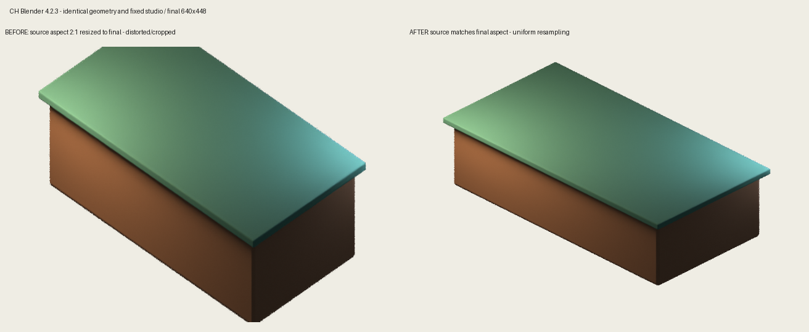

# CH Blender: render quality corrections and comparison

## What was inconsistent

| Problem | Previous behavior | Corrected behavior |
| --- | --- | --- |
| Source/final proportions | Each source axis independently rounded to a power of two; final resizing distorted geometry | One uniform integer supersampling factor; mismatched source/final aspect is rejected |
| Orthographic framing | Landscape `ortho_scale` treated as vertical span | Blender AUTO sensor fit respected; evaluated geometry across all four rotations fitted |
| Proxy fidelity | Square proxy could differ from rectangular bake; EEVEE preview versus Cycles final | Exact bake aspect, Cycles at 8 samples by default, original hidden-object state preserved in proxy and final color/shadow passes |
| Instructions | Footprint metadata only loosely bounded authored geometry | Optional job requirements enforce asset identity, exact tile dimensions, semantic parts and world-space dimension limits |
| Camera/studio | Contract label did not prove actual camera/light state | Actual 45°/30° orthographic projection, fixed camera/lights/color settings, studio fingerprints and drift checks |
| Materials/errors | Requested material recipe failures could fall back to flat; Blender Python exceptions could exit successfully | Explicit recipe errors; every worker invocation uses `--python-exit-code 1` |
| Review | Fixed 256px panels cropped large images; arbitrary PNG scale described as gameplay-sized | Whole native sprites retained; synthetic grid explicitly calibrated to projected world tile 128×64 |
| Provenance | Builder/profile hashes did not identify imported geometry helpers or recipe | Recipe/config/preset and recursive local Python dependency hashes plus ordered authoring options; fingerprint checked when final review supplies it |
| Queue | 19 historical jobs referred to removed sources or violated final review gates | Original JSON preserved outside the active queue, with individual retirement reasons |

## Reproducible comparison

Blender **4.2.3 LTS**, identical fixture geometry, same fixed studio and camera. The fixture is a framing regression, not a proposed production asset or artistic approval.

- Final canvas: **640×448**.
- Old independently rounded source: **4096×2048**. Resampling X/Y ratio: **0.714286**, meaning vertical dimensions stretch **40% relative to horizontal**. A 2:1 ground tile becomes approximately 1.43:1.
- Corrected source: **2560×1792**, uniform 4×. Resampling X/Y ratio: **1.0**.
- Actual Blender projection measured ground tile ratio **2.00000018:1** after correction.
- All SOUTH/EAST/WEST/NORTH evaluated bounds fit inside the camera. A wrong requested size, changed camera, changed light and oversized array modifier are each rejected. Final color/shadow passes restore visibility without resurrecting hidden alternatives.
- Real `commercial_bakery_2x2_01` guarded proxy passed with source **1280×1152**, final **320×288**, proxy **250×225**, requested 2×2 footprint and min world dimensions [3, 3, 1]. Its light/dark/grid review was inspected.
- The same bakery with requested minimum X size 99 was rejected as `BLENDER_FAILED` (exit 20) with `CH_PREFLIGHT_REQUIREMENTS`, before rendering. It no longer masquerades as a successful Blender process followed by missing output.

Run from repository root:

```bash
python -m unittest discover -s tools/ch_blender/tests -v
PYTHONPATH=tools/tycoon_photo_studio python -m unittest discover -s tools/tycoon_photo_studio/tests -v
"$CH_BLENDER_EXE" --background --factory-startup --python-exit-code 1 \
  --python tools/ch_blender/tests/blender_render_quality_probe.py \
  -- --output out/ch_blender_quality/regression
```

The interface workflow runs these framing regressions with the pinned Blender and uploads `before_source.png`, `after_source.png`, proxy and measured JSON reports. Legacy-source renders require resizing to the declared final aspect to observe the distortion. Unit tests cover preservation of large review pixels, exact proxy aspect, empty alpha rejection, input validation, option changes and source dependency changes. Local validation: **17 interface/quality tests + 6 studio tests passed**, plus actual Blender fixture and bakery runs.



## Request and review contract

For new guarded work, include measurable intent in the job, for example:

```json
"assetRequirements": {
  "contract": "CH_ASSET_REQUIREMENTS_V1",
  "assetId": "building.example.01",
  "footprint": {"widthTiles": 2, "depthTiles": 2},
  "requiredRoles": ["building.body", "building.roof"],
  "minDimensions": [3, 3, 1],
  "maxDimensions": [6, 6, null]
}
```

Dimensions are world axes in Blender units (3 units/tile), measured from evaluated visible authored geometry before direction rotation. Roles must be tagged by the builder. Compare the proxy in the generated 128×64 grid; do not judge game readability only from a zoomed render. New final jobs with requirements must copy both reviewed proxy SHA and `sourceFingerprint` into approval. Changes to tracked authoring inputs require a new review.

## Limits

These corrections remove demonstrated distortion, cropping, misleading previews and silent failures. They do not invent coherent silhouettes, architectural details or correct object semantics. Those still depend on authored recipes and visual review. Low-sample proxy noise remains possible. A synthetic tile grid is not a MapForge/runtime capture. Dynamically loaded assets, textures, external modules and arbitrary script behavior are not comprehensively captured by local Python-import hashing. Existing final jobs without request constraints retain legacy approval compatibility. No runtime art was automatically promoted or reapproved.

## Additional compatibility failures exposed by CI

The new interface/real-Blender workflow passed on the published change. Other older workflows revealed existing mismatches: classic trees read removed `srcResolution` before the compatibility wrapper ran; characters called the scene API with two arguments; kiosk CI still demanded the retired `CH_TYCOON_MINIATURE_V1`; the internal Blender identity patch had a corrupt hunk count. These callers now use the current scene API and current style contract, and the identity patch validates against the exact frozen upstream source. Trees now record calibrated framing and actual studio identity. Character resolution preserves the existing preset scale and exact source/final aspect.

`blender_legacy_builder_probe.py` exercises the actual tree and character main entrypoints in Blender 4.2.3: **4 tree directions and 64 character direction/pose combinations** with evaluated bounds and fixed studio checks, plus a cheap render for each builder. Remaining passes are intercepted for validation rather than performing full production bakes; this is explicitly an integration probe, not final art approval. The probe passed locally and is included in the interface CI artifact.
